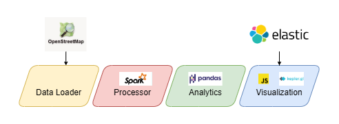

<div align="center">

# 🌍 Urban Map Explorer




</div>


We present an efficient, Big Data–ready workflow for downloading urban data from OpenStreetMap and presenting it through an intuitive, user-friendly interface. The platform enables interactive exploration, service selection, simple queries, and service filtering, combining a Kepler.gl–powered visualization with an integrated query tool.

## Workflow

### OpenStreetMap data Download
   - Osmnx API
   - Identify available services and categories for the selected cities

### Spark Data Processing
   - Spark session initialization
   - Service mapping into macro-categories
   - Computing of H3-indexes for geographic cell renedring
   - Aggregation of services by H3 cells
   - Computation of **Empirical Accessibility Index**

### ElasticSearch Index Creation
   - Index creation
    - Enabling queries for city, service type, number of services

### Statistical analysis
   - Computation of insights for city accessibility comparison
   - Creation of syntethic descriptive reports

### Visualization
   - Creation of interactive map with **Kepler.gl** framework
   - Display aggregated and category-filtered services per H3 hexagon
   - Integration of intuitive query tool

## Services and POIs considered

<div align="center">
🏥 <strong>Health</strong> &ensp;
📚 <strong>Education</strong> &ensp;
🍕 <strong>Food</strong> &ensp;
🛒 <strong>Food Retail</strong> &ensp;
🛍️ <strong>Retail</strong> &ensp;
✂️ <strong>Services</strong> &ensp;
💳 <strong>Financial</strong> &ensp;
🏛️ <strong>Public Services</strong> &ensp;
👮 <strong>Security</strong> &ensp;
⚽ <strong>Sports</strong> &ensp;
🌳 <strong>Recreation</strong> &ensp;
🎭 <strong>Culture</strong> &ensp;
⛪ <strong>Religion</strong> &ensp;
🚲 <strong>Transportation</strong> &ensp;
🏨 <strong>Tourism</strong> &ensp;
⚖️ <strong>Professional Services</strong> &ensp;
🚮 <strong>Public Utilities</strong> &ensp;
</div>


## Empirical Accessibility Index

To measure accessibility in a given urban area in a way that allows meaningful comparisons between different areas, we developed an empirical index based on survey data collected from our colleagues. The index is designed to be simple yet effective, as it captures the overall perceived utility of the services available in an urban area according to people’s preferences.

For each H3 cell, the index is computed using the following formula:

$$
EAI = \frac{1}{N}\sum{w_in_i}
$$

where 
- $N$: total number of services in the cell
- $w_i$: empirical weight for the $i$-th service
- $n_i$: occurrences of the $i$-th service in the cell

## Get started

### Basic Requirements
- Python 3.10 🐍 (tested ✅)
- Docker 28.2 🐋(tested ✅)

### Python Virtual environment
To create and activate the PIP virtual environment run
```bash
python3 -m venv URBAN
source URBAN/bin/activate
pip install -r requirements.txt
```

### Docker installation
Follow the installation tutorial for your system in the <a href="https://docs.docker.com/engine/install/">Docker Engine installation page</a>

### Run Elasticsearch Container
To enable the use of ElasticSearch, make it run in a docker container
```bash
sudo docker rm -f elasticsearch 2>/dev/null

sudo docker run -d \
  --name elasticsearch \
  -p 9200:9200 \
  -m 1g \
  -e discovery.type=single-node \
  -e xpack.security.enabled=false \
  -e ES_JAVA_OPTS="-Xms512m -Xmx512m" \
  -e http.cors.enabled=true \
  -e 'http.cors.allow-origin="/.*/"' \
  -e http.cors.allow-methods=OPTIONS,HEAD,GET,POST \
  -e http.cors.allow-headers=Content-Type \
  elasticsearch:8.17.0
```
❗This step is recommended but not necessary, in fact, if you don't start the Docker container you won't be able create the ElasticSearch index and perform queries inside the interactive map, but you will however be able to explore and set filters manually from the native UI.

### Build Interactive Explorer
To start the pipeline run the following commands from the root of the project.
```bash
python3 run_analysis.py
```
- Enter up to three cities to display on the map. At most one may be <a href="https://operations.osmfoundation.org/policies/nominatim/">too large</a>.
- Then enter the desired resolution for H3 cells (usually values from 8 to 10).

At this stage, the report and the interactive map have been produced and are available in the `output/` directory.

To run the map explorer, execute
```bash
python3 output/launch_explorer.py
```
then go to the local address where the page is hosted.

---


<p align="center">
  Cardia F. Loddo M. N.<br>
  Big Data Project 2025/2026<br>
  CdLM in Computer Science - Applied Artificial Intelligence<br>
  Cagliari State University
</p>